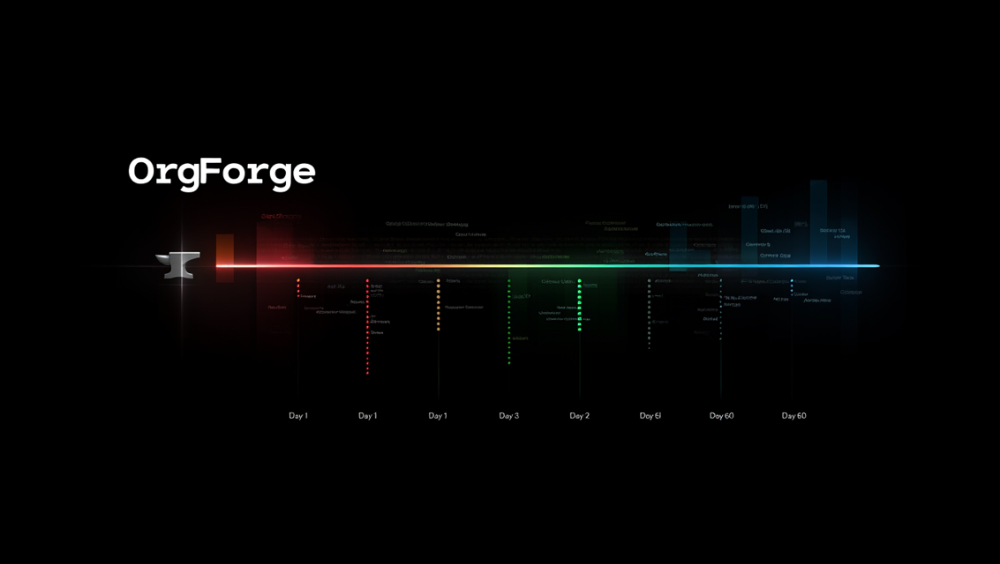

# OrgForge


[](https://doi.org/10.5281/zenodo.19036018)

[](https://github.com/aeriesec/orgforge/actions/workflows/tests.yml)
[](https://huggingface.co/datasets/aeriesec/orgforge)

### A deterministic corporate simulator for generating ground-truth ecosystems and evaluating enterprise AI agents



OrgForge simulates weeks of realistic enterprise activity: Confluence pages, JIRA tickets, Slack threads, Git PRs, Zoom transcripts, Zendesk tickets, Salesforce records, emails, and server telemetry. It is grounded in an event-driven state machine so LLMs cannot hallucinate facts out of sequence.

The dataset is the exhaust of a living simulation. Engineers leave mid-sprint, forcing deterministic incident handoffs, ticket reassignments, and CRM ownership lapses. Knowledge gaps surface when under-documented systems break. New hires build their internal network through simulated collaboration. Stress propagates through a live, weighted social graph. Every artifact reflects the exact state of the org at the moment it was written.


## Table of Contents

- [Why Does This Exist?](#why-does-this-exist)
- [What the Output Looks Like](#what-the-output-looks-like)
- [What Gets Generated](#what-gets-generated)
- [Architecture & Mechanics](#architecture--mechanics)
- [The Departure Cascade](#the-departure-cascade)
- [Insider Threat Simulation](#insider-threat-simulation)
- [Quickstart](#quickstart)
  - [Setup Options](#setup-options)
  - [Option 1 — Everything in Docker](#option-1--everything-in-docker-recommended)
  - [Option 2 — Local Ollama, Docker for MongoDB Only](#option-2--local-ollama-docker-for-mongodb-only)
  - [Option 3 — Cloud Preset](#option-3--cloud-preset-aws-bedrock--openai)
  - [Running on AWS EC2](#running-on-aws-ec2)
- [Configuration](#configuration)
  - [Quality Presets & Multi-Provider Support](#quality-presets--multi-provider-support)
  - [Key Config Fields](#key-config-fields)
  - [Dynamic Org Lifecycle](#dynamic-org-lifecycle)
- [How the Event Bus Works](#how-the-event-bus-works)
- [Memory Requirements](#memory-requirements)
- [Project Structure](#project-structure)
- [Roadmap](#roadmap)
- [Adding a New Artifact Type](#adding-a-new-artifact-type)
- [Contributing](#contributing)
- [Citation](#citation)
- [License](#license)


## Why Does This Exist?

When building AI agents that reason over institutional knowledge, you need a realistic corpus to test against. The only widely-used corporate dataset is the Enron email corpus: 25 years old, legally sensitive, and covering one company in crisis.

OrgForge generates that corpus from scratch, parameterized to any company, industry, or org structure. LLMs write the prose, but the facts (who was on-call, which ticket was open, when the incident resolved, who just left the team, and which customer SLA was breached) are strictly controlled by the state machine.

**The central design bet:** grounding LLM output in a deterministic event log makes the dataset actually useful for evaluating retrieval systems. You have ground truth about what happened, when, who was involved, and what the org's state was, so you can measure whether an agent surfaces the right context, not just plausible-sounding context.


## What the Output Looks Like

Here's what a slice of a real simulation produces. An incident fires on Day 8:

**`slack/channels/engineering-incidents.json`** — the alert arrives first, timestamped to the millisecond the on-call pager fired:

```json
{
  "ts": "2026-03-10T14:23:07",
  "user": "pagerduty-bot",
  "text": "🔴 P1 ALERT: TitanDB latency spike — connection pool exhaustion under load. On-call: Jax."
}
```

**`jira/IT-108.json`** — opened seconds later, facts pulled from the same SimEvent:

```json
{
  "id": "IT-108",
  "type": "incident",
  "priority": "P1",
  "title": "TitanDB: latency spike",
  "root_cause": "connection pool exhaustion under load",
  "assignee": "Jax",
  "reporter": "system",
  "opened": "2026-03-10T14:23:19"
}
```

**`confluence/postmortems/IT-108.md`** — written the next day, linking the same root cause and PR:

> *This incident was triggered by connection pool exhaustion under sustained load, first surfaced in IT-108. The fix landed in PR #47 (merged by Sarah). A prior knowledge gap in TitanDB connection management — stemming from Jordan's departure on Day 12 — contributed to the delayed diagnosis.*

Meanwhile, the `datadog/metrics.jsonl` time-series data reflects the exact latency spike, Zendesk support tickets from affected customers are automatically escalated to 'Urgent', Salesforce opportunities are flagged as 'at-risk', and end-of-month customer invoices (`invoices/`) automatically apply SLA credits based on the incident's duration.

## What Gets Generated

A default 22-day simulation produces:

| Artifact                   | Description                                                                                                                 |
| -------------------------- | --------------------------------------------------------------------------------------------------------------------------- |
| `confluence/`              | Seed documents, ad-hoc wikis, and post-incident write-ups grounded in actual root causes                                    |
| `jira/`                    | Sprint tickets, P1 incident tickets with linked PRs                                                                         |
| `slack/channels/`          | Standup transcripts, incident alerts, engineering chatter, bot messages                                                     |
| `git/prs/`                 | Pull requests with reviewers, merge status, linked tickets                                                                  |
| `zoom/`                    | Verbatim meeting transcripts from sync design discussions, capturing undocumented verbal decisions                          |
| `salesforce/`              | CRM accounts and active sales opportunities, including risk flags propagated from active incidents                          |
| `zendesk/`                 | Customer support tickets and comments, automatically escalated during system outages                                        |
| `emails/`                  | External inbound/outbound emails: customer complaints, vendor messages, HR communications, sales updates                    |
| `datadog/`                 | Time-series system metrics (`metrics.jsonl`) and alert payloads (`alerts.jsonl`) reflecting incident degradation & recovery |
| `nps/`                     | Post-simulation customer satisfaction surveys, scored deterministically based on SLA breaches and support ticket resolution |
| `invoices/`                | End-of-month customer invoices featuring SLA credit line items calculated directly from incident duration                   |
| `simulation_snapshot.json` | Full state: incidents, morale curve, system health, relationship graph, departed employees, new hires, knowledge gap events |
| `simulation.log`           | Complete chronological system and debug logs for the entire run                                                             |


## Architecture & Mechanics

OrgForge is not an LLM wrapper. Four interlocking systems enforce correctness.

👉 **[Read the full Architecture Deep-Dive here.](ARCHITECTURE.md)**


## The Departure Cascade

The most complex behavior in the simulation. When an engineer departs mid-sprint, the following fires in order before that day's planning runs:

1.  **Incident handoff** — active incidents assigned to the departing engineer are rerouted via Dijkstra escalation routing (while the node is still in the graph) to the next available person in the chain.
2.  **Ticket & CRM reassignment** — orphaned JIRA tickets go to the dept lead. Salesforce accounts and open opportunities owned by the departed employee are flagged for reassignment, maintaining cross-domain ground truth.
3.  **Graph recompute** — betweenness centrality is recalculated on the smaller graph. Engineers absorbing the departed node's bridging load receive a proportional stress hit.
4.  **Knowledge gap propagation** — if the departed engineer owned undocumented domains (configured via `documented_pct`), those gaps are registered in the SimEvent log and surface in subsequent incidents as contributing factors.
5.  **`employee_departed` SimEvent** — emitted with edge snapshot, centrality at departure, reassigned tickets, and incident handoffs. Full ground truth for retrieval evaluation.

So when Jordan leaves on Day 12, the postmortem on Day 9's incident doesn't mention her. But the postmortem on Day 15 might: *"A prior knowledge gap in auth-service, stemming from a recent departure, contributed to the delayed diagnosis."* That sentence is grounded in a real SimEvent, not LLM inference.


## Insider Threat Simulation

OrgForge includes an optional insider threat module that layers adversarial behavior on top of the normal simulation, without touching any of the clean simulation paths. When disabled (the default), it is completely inert: no overhead, no additional output, no altered code paths.

When enabled, designated employees exhibit configurable threat behaviors across multiple surfaces: anomalous git activity, off-hours access, sentiment drift in Slack, data staging on their workstation, and IDP authentication anomalies. All threat telemetry is written to a separate `security_telemetry/` directory in industry-standard log formats (JSONL, CEF, ECS, LEEF), keeping it cleanly isolated from the normal simulation output so detection agents must work to find it.

The module is designed for building and evaluating insider threat detection systems. Ground truth is always preserved in JSONL regardless of output format.

👉 **[Read the full Insider Threat reference here.](INSIDER_THREAT.md)**


## Quickstart

`flow.py` is the main simulation entry point. `config/config.yaml` is the single source of truth for org structure, personas, and quality presets.

### Setup Options

| Scenario                           | Command                              | Notes                                  |
| ---------------------------------- | ------------------------------------ | -------------------------------------- |
| Everything in Docker               | `docker compose up`                  | Recommended for first run              |
| Local Ollama + Docker for the rest | `docker compose up mongodb orgforge` | Set `OLLAMA_BASE_URL` in `.env`        |
| Cloud preset (any provider)        | `docker compose up mongodb orgforge` | Set credentials in `.env`, skip Ollama |

### Option 1 — Everything in Docker (Recommended)

```bash
git clone https://github.com/aeriesec/orgforge
cd orgforge
docker compose up
```

When the simulation finishes, run the post-processing artifact generators:

```bash
python post_sim_artifacts.py
```

Output lands in `./export/`.

### Option 2 — Local Ollama, Docker for MongoDB Only

Create a `.env` file:

```bash
OLLAMA_BASE_URL=http://host.docker.internal:11434
```

Then:

```bash
docker compose up mongodb orgforge
```

> **Linux note:** `host.docker.internal` requires Docker Desktop, or the `extra_hosts: host-gateway` entry in `docker-compose.yaml` (already included).

### Option 3 — Cloud Preset (Any Provider)

Best output quality. Uses CrewAI's multi-provider `LLM` class, which auto-detects the provider from the model string. Supported providers include OpenAI, Anthropic, AWS Bedrock, Google Gemini, Groq, and Azure.

Set `quality_preset: "cloud"` in `config.yaml`, then:

```bash
# .env — set the env vars for whichever provider(s) you configure
AWS_ACCESS_KEY_ID=...          # for Bedrock
AWS_SECRET_ACCESS_KEY=...
AWS_DEFAULT_REGION=us-east-1
OPENAI_API_KEY=...             # for OpenAI
ANTHROPIC_API_KEY=...          # for Anthropic
```

```bash
pip install crewai boto3 openai
docker compose up mongodb orgforge
```

**Using OpenAI directly** — add an `openai` preset to `config/config.yaml`:

```yaml
quality_presets:
  cloud:
    provider: openai
    planner: gpt-4o
    worker: gpt-4o-mini
```

Then set `quality_preset: "openai"` and ensure `OPENAI_API_KEY` is in `.env`. No code changes needed.

**Using Anthropic directly** — same pattern:

```yaml
quality_presets:
  cloud:
    provider: anthropic
    planner: claude-sonnet-4-20250514
    worker: claude-haiku-3-5-20241022
```

Set `ANTHROPIC_API_KEY` in `.env` and you're done.

### Running on AWS EC2

**Cheap EC2 + Cloud API (no GPU required)**

A `t3.small` works fine: the cloud APIs do all the heavy lifting.

1.  Launch an EC2 instance (Ubuntu or Amazon Linux) and install Docker
2.  `git clone https://github.com/aeriesec/orgforge.git && cd orgforge`
3.  `cp .env.example .env` and fill in your credentials
4.  Set `quality_preset: "cloud"` (or `openai`, `anthropic`, `gemini`) in `config/config.yaml`
5.  `docker compose up --build -d mongodb orgforge`

**GPU Instance + 70B Local Models**

For `Llama 3.3 70B` entirely locally, use a `g5.2xlarge` or `g5.12xlarge` with the Deep Learning AMI. Uncomment the GPU `deploy` block under the `ollama` service in `docker-compose.yaml`, set `quality_preset: "local_gpu"`, then `docker compose up -d`.

---

## Configuration

`config/config.yaml` is the single source of truth. No Python changes are needed for most customizations.

### Quality Presets & Multi-Provider Support

OrgForge uses CrewAI's `LLM` class, which auto-detects the provider from the model string. This means you can use any supported provider by simply adding a preset to your config and setting the corresponding API key environment variable.

| Provider   | Model Example                       | Env Var Required      |
| ---------- | ----------------------------------- | --------------------- |
| Ollama     | `llama3.3:70b-instruct-q4_KM`       | `OLLAMA_BASE_URL`     |
| AWS Bedrock | `us.anthropic.claude-sonnet-4-20250514-v1:0` | `AWS_ACCESS_KEY_ID`, `AWS_SECRET_ACCESS_KEY` |
| OpenAI     | `gpt-4o`                            | `OPENAI_API_KEY`      |
| Anthropic  | `claude-sonnet-4-20250514`          | `ANTHROPIC_API_KEY`   |
| Gemini     | `gemini-2.5-pro`                    | `GEMINI_API_KEY`      |
| Groq       | `groq/llama-3.1-70b-versatile`      | `GROQ_API_KEY`        |
| Azure      | `azure/gpt-4o`                      | Azure credentials     |

**Built-in presets:**

```yaml
quality_preset: "local_gpu" # local_gpu | cloud | openai | anthropic
```

| Preset      | Planner                     | Worker                | Best For                 |
| ----------- | --------------------------- | --------------------- | ------------------------ |
| `local_gpu` | llama3.3:70b-instruct-q4_KM | llama3.1:8b-instruct  | High-fidelity local runs |
| `cloud`     | Claude Sonnet (Bedrock)     | llama3.1:8b (Bedrock) | Best output quality      |
| `openai`    | gpt-4o                      | gpt-4o-mini           | Fastest cloud setup      |
| `anthropic` | claude-sonnet-4-20250514    | claude-haiku-3-5-20241022 | Anthropic-native access |

**Adding your own preset**: just add a block under `quality_presets` in `config/config.yaml`:

```yaml
quality_presets:
  gemini:
    provider: gemini
    planner: gemini-2.5-pro
    worker: gemini-2.0-flash
```

Then set the corresponding API key in `.env` and switch `quality_preset: "gemini"`. That's it — CrewAI handles the routing.

### Key Config Fields

| Field                     | Purpose                                                                         |
| ------------------------- | ------------------------------------------------------------------------------- |
| `company_name`            | Injected into all generated prose                                               |
| `simulation_days`         | Length of the simulation (default: 22)                                          |
| `legacy_system`           | The unstable system referenced in incidents, tickets, and docs                  |
| `crm`                     | Enable/disable Salesforce and Zendesk simulation integrations                   |
| `sprint_ticket_themes`    | Pool of ticket titles drawn during sprint planning                              |
| `adhoc_confluence_topics` | Spontaneous wiki pages generated on normal days                                 |
| `knowledge_gaps`          | Static departed employees whose absence creates documentation gaps from day one |
| `org_lifecycle`           | Dynamic departures and hires that occur during the simulation (see below)       |
| `roles`                   | Maps simulation roles (on-call, incident commander, HR lead) to departments     |
| `morale`                  | Decay rate, recovery rate, intervention threshold                               |
| `org_chart` + `leads`     | Everyone in the company and who runs each department                            |
| `personas`                | Writing style, stress level, and expertise per named employee                   |
| `external_contacts`       | Vendors, customers, and cloud providers that get pulled into incidents          |

### Dynamic Org Lifecycle

Engineers can join and leave during the simulation. Departures and hires are scheduled in config and execute before the day's planning runs, so every downstream artifact that day reflects the new roster.

```yaml
org_lifecycle:
  scheduled_departures:
    - name: "Jordan"
      day: 12
      reason: "voluntary" # voluntary | layoff | performance
      role: "Senior Backend Engineer"
      knowledge_domains:
        - "auth-service"
        - "redis-cache"
      documented_pct: 0.25 # fraction written down: drives gap severity

  scheduled_hires:
    - name: "Taylor"
      day: 15
      dept: "Engineering"
      role: "Backend Engineer"
      expertise: ["Python", "FastAPI"]
      style: "methodical, asks lots of questions before writing code"
      tenure: "new"

  enable_random_attrition: false
  random_attrition_daily_prob: 0.005
```

On hire, the new engineer enters the graph with cold-start edges below the `warmup_threshold`, so the day planner naturally proposes `warmup_1on1` and `onboarding_session` events until real collaboration warms the edges.

---

## How the Event Bus Works

Every significant action emits a `SimEvent`:

```python
SimEvent(
    type="incident_opened",
    day=8,
    date="2026-03-10",
    actors=["Jax", "Sarah"],
    artifact_ids={"jira": "IT-108"},
    facts={
        "title": "TitanDB: latency spike",
        "root_cause": "connection pool exhaustion under load",
        "involves_gap": True
    },
    summary="P1 incident IT-108: connection pool exhaustion",
    tags=["incident", "P1"]
)
```

Every downstream artifact pulls its facts from the event log rather than asking an LLM to invent them. This prevents temporal drift and hallucination across a multi-week simulation.

The end-of-day `day_summary` SimEvent captures a structured snapshot of everything that happened:

```python
facts={
    "active_actors":        ["Jax", "Sarah", "Morgan"],
    "dominant_event":       "incident_opened",
    "event_type_counts":    {"incident_opened": 1, "pr_review": 2, "standup": 1},
    "departments_involved": ["Engineering"],
    "open_incidents":       ["IT-108"],
    "stress_snapshot":      {"Jax": 72, "Sarah": 55, "Morgan": 41},
    "health_trend":         "degraded",
    "morale_trend":         "moderate",
}
```


## Memory Requirements

| Preset      | RAM Required | Notes                                    |
| ----------- | ------------ | ---------------------------------------- |
| `local_gpu` | ~48 GB VRAM | Llama 3.3 70B: requires A100 or 2x A10G  |
| Cloud presets (openai, anthropic, cloud, gemini) | ~500 MB | Only MongoDB + Python run locally |

For `local_gpu` on AWS, a `g5.2xlarge` (A10G 24GB) runs 70B at q4 quantization. At ~$0.50/hour spot pricing a full 22-day simulation costs roughly $3–5.

## Roadmap

- [x] Native integrations for Zoom, Zendesk, and Salesforce CRM
- [x] Multi-provider LLM support via CrewAI (OpenAI, Anthropic, Bedrock, Gemini, Groq, Azure)
- [ ] Plugin architecture for additional integrations (PagerDuty, Workday, etc.)
- [ ] Domain packs: pre-configured `config.yaml` templates for healthcare, fintech, legal
- [x] Export to HuggingFace dataset format
- [x] Evaluation harness: benchmark RAG retrieval against SimEvent ground truth


## Adding a New Artifact Type

1.  Add an event emission in `flow.py` when the triggering condition occurs
2.  Write a handler that reads from the SimEvent log and generates the artifact

A formal plugin architecture is on the roadmap. Open an issue before starting so we can align on the interface.


## Contributing

Contributions are welcome. Please read **[CONTRIBUTING.md](CONTRIBUTING.md)** before opening a PR. For new domain configs or artifact types, open an Issue first.


## Citation

If you use this work, please cite:

```bibtex
@article{Flynt2026,
  author = {Jeffrey Flynt},
  title  = {OrgForge: A Multi-Agent Simulation Framework for Verifiable Synthetic Corporate Corpora},
  year   = {2026},
  url    = {https://arxiv.org/abs/2603.14997}
}
```


## License

MIT — see **[LICENSE](LICENSE)**.
